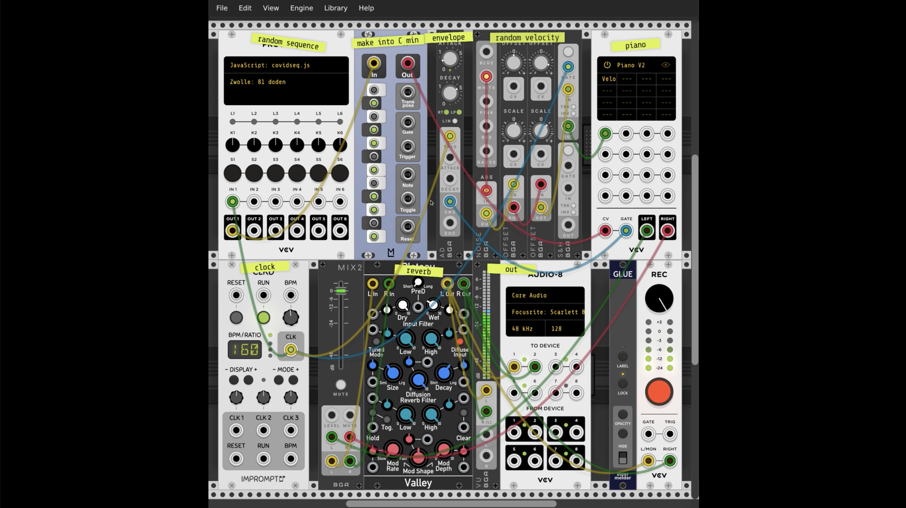

# covidseq
Covidseq is a sequencer for [VCV Rack](https://vcvrack.com), written in memoriam of the deceased because of COVID-19 in the Netherlands.

The ```covidseq.js``` script is intended to be used as configuration for [VCV Rack's "Prototype" module](https://library.vcvrack.com/VCV-Prototype/Prototype). It generates a sequence of voltages centred around C4 (0V) that can used to feed an oscillator, a quantiser etc. to create melodies. As it runs, it displays the most recent number of total deaths and the municipalities they were recorded at.

The sequence is generated by running the ```prepare-data.js``` script and copying and pasting the resulting scriptlet in ```covidseq.js```. Each semitone from 3 octaves ([configurable in ```prepare-data.js```](https://github.com/giacecco/covidseq/blob/f38aef085b1ed66c991c7e130d46258dd4e8af32/prepare-data.js#L19)) is associated to groups of municipalities in the Netherlands, so that each semitone represents the same number of deaths. Municipalities with small numbers of deaths will be grouped and associated to the same semitone. Municipalities with large numbers of deaths will span over multiple semitones. The higher the number of deaths, the more likely the municipality will be represented in the sequence.

The data is fetched at the moment the script is executed, from the open data offered by the Dutch National Institute for Public Health and the Environment [here](https://data.rivm.nl/covid-19/). Every day the sequence will change, until there won't be any more deaths because of COVID-19.

In this repository you can also find ```vcv-example-project.vcv```, that is a sample VCV Rack project that uses ```covidseq.js```. The sequence is passed through a quantiser, so that the notes are reduced to the C minor scale. Below is a video showing how it is used to play a hunting random sequence of notes from C minor on an Arturia Piano V2.

[](https://youtu.be/TVsYDPLtMos)
